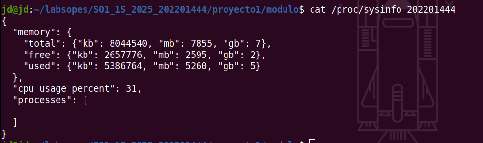
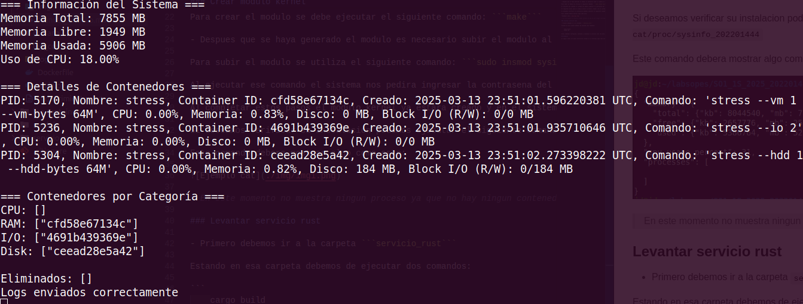
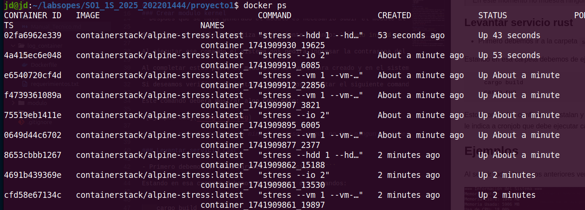
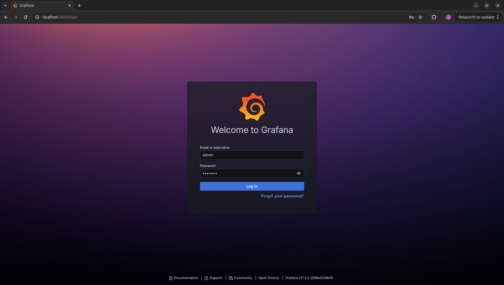
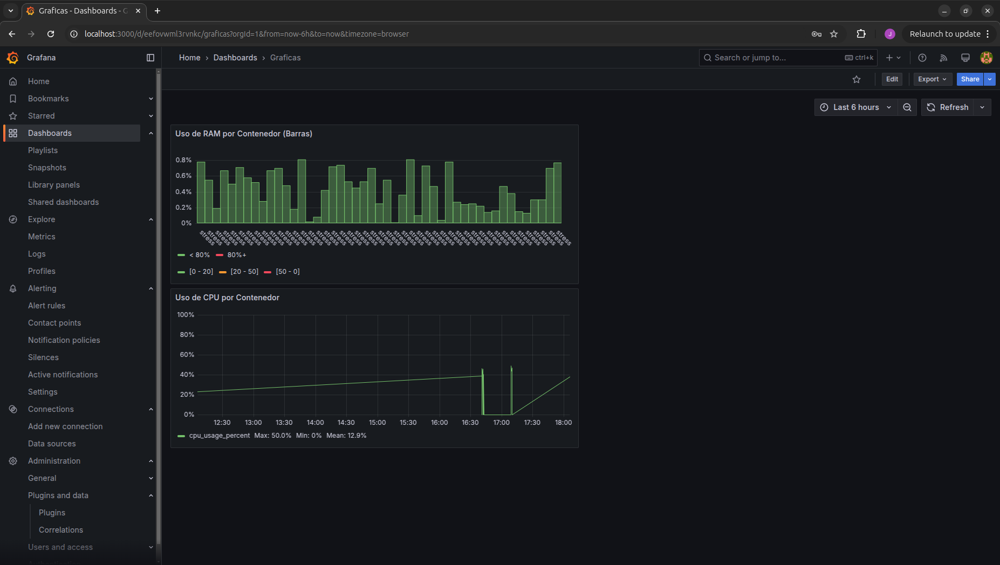

# MANUALTECNICO - PROYECTO 1 SOPES

En este manual se explicara el uso y funcionamiento del proyecto, asi como los requerimientos para poder ejecutarlo1.

---

## Requerimientos

- Sistema operativo Linux
- Tener Docker
- Tener Python
- Tener Rust

## Uso

### Crear modulo kernel

- Primero ir a la carpeta ```modulo/```

En esa carpeta se encuentra un archivo Makefile el cual facilita la creacion del modulo.

Para crear el modulo se debe ejecutar el siguiente comando: ```make```

- Despues que se haya generado el modulo es necesario subir el modulo al kernel

Para subir el modulo se utiliza el siguiente comando: ```sudo insmod sysinfo_202201444.ko```

Al ejecutar ese comando el sistema nos pedira ingresar la contrasena del sistema.

Al completar estos pasos el modulo kernel ya estara creado y en el sistema de la computadora.

Si deseamos verificar su instalacion podemos ejecutar el siguiente comando: ```sudo cat/proc/sysinfo_202201444```

Este comando debera mostrar algo como esto:



> En este momento no muestra ningun proceso ya que no hay ningun contenedor levantado.

### Levantar servicio rust

- Primero debemos ir a la carpeta ```servicio_rust```

Estando en esa carpeta debemos de ejecutar dos comandos:

```
    cargo build
    cargo run
```

Estos comandos configuran, instalan y levantan el servicio rust. En este momento el servicio rust le indica a cronjob que debe ejecutar cada 30 segundos el scrip de los contenedores

## Ejemplos

Al seguir todos los pasos anteriores veremos en la terminal algo como esto:



Esto nos indica que el servicio de rust esta funcionando correctamente.

Para comprobar que los contenedores se estan generando correctamente podemos ingresar el comando: ```docker ps```



## Graficas

Para las graficas se utilizo grafana para una mejor visualizacion de los datos.

### Levantar contenedor

Para ver las graficas debemos de levantar el contenedor con grafana.

- Primero debemos estar en la carpeta ```grafana/```

Al estar dentro de esa carpeta debemos ejecutar el siguiente comando:

```docker-compose up -d```

Ese comando levantara el contenedor con grafana en el puerto ```3000```

### Ingresar a grafana

Para ingresar a grafana en el navegador debemos de ingresar la siguiente url : ```localhost:3000```

Esto nos abrira grafana en el navegador, nos pedira ingresar el usuario y contrasena.



Al ingresar las credenciales entraremos al dashboard donde podremos observar las graficas.


