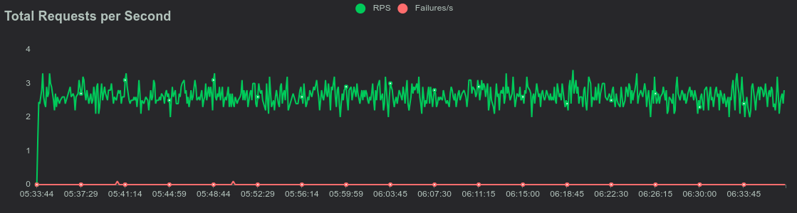
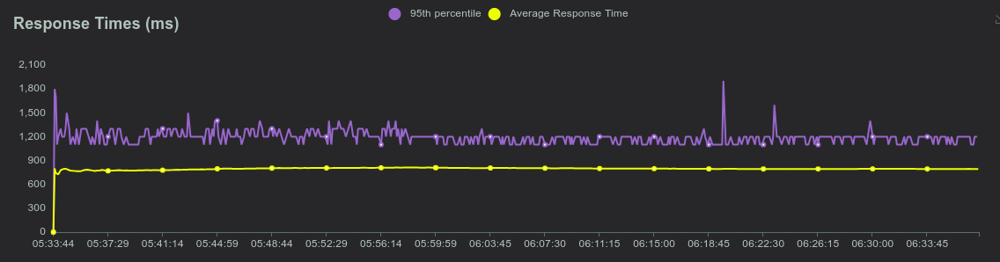
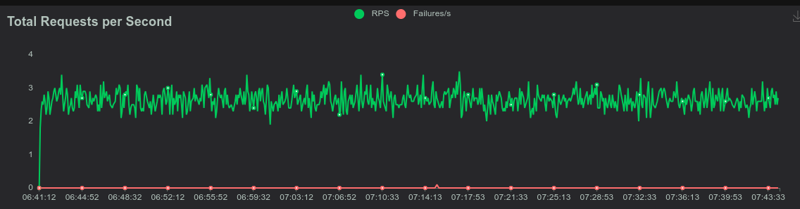
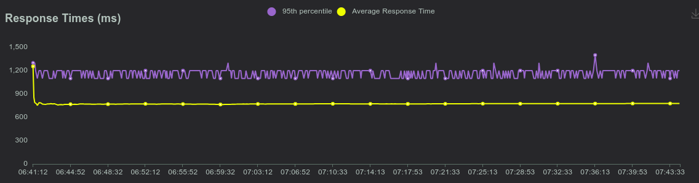

# **Manual tecnico Proyecto 2**

---

## **Arquitectura general del proyecto**

- Entrada: Los datos climáticos se envían vía HTTP POST a http://35.232.228.213.nip.io/input.

- API REST (rust-api-service): Recibe las solicitudes y las envía al go-api-service vía gRPC.

- API gRPC (go-api-service): Recibe los datos y los envía a go-kafka-writer y go-rabbitmq-writer.

- go-kafka-writer: Publica los datos en el topic weather de Kafka.

- go-rabbitmq-writer: Publica los datos en la cola message de RabbitMQ.

- kafka-consumer: Lee de Kafka y almacena en Redis.

- rabbitmq-consumer: Lee de RabbitMQ y almacena en Valkey.

- Redis y Valkey: Almacenan los contadores de países y el total de mensajes.

- Grafana: Visualiza los datos mediante un dashboard.

## **Lista de deployments**

### Rust API

#### rust-deployment

```yaml
apiVersion: apps/v1
kind: Deployment
metadata:
  name: rust-api-deployment
  namespace: proyecto2  # Usa un namespace como se sugiere en el documento
  labels:
    app: rust-api
spec:
  replicas: 1  # Comienza con 1 réplica (mínimo según el documento)
  selector:
    matchLabels:
      app: rust-api
  template:
    metadata:
      labels:
        app: rust-api
    spec:
      containers:
      - name: rust-api
        image: 34.132.81.228.nip.io/proyecto2sopes/rust-api:latest  # Imagen de Harbor
        ports:
        - containerPort: 8080  # Puerto donde tu API REST en Rust escucha
        resources:
          requests:
            cpu: "75m"  # Solicita un mínimo de CPU
            memory: "256Mi"
          limits:
            cpu: "400m"  # Límite de CPU para que HPA funcione bien
            memory: "512Mi"
```

Este deployment contiene la API REST escrita en Rust que recibe las solicitudes HTTP POST en el endpoint /input. Actúa como el punto de entrada del sistema y envía los datos al go-api-service (gRPC).

#### rust-ingress

```yaml
apiVersion: networking.k8s.io/v1
kind: Ingress
metadata:
  name: rust-api-ingress
  namespace: proyecto2
spec:
  ingressClassName: nginx
  rules:
  - host: 35.232.228.213.nip.io
    http:
      paths:
      - path: /input
        pathType: Prefix
        backend:
          service:
            name: rust-api-service
            port:
              number: 80
```

#### rust-service

```yaml
apiVersion: v1
kind: Service
metadata:
  name: rust-api-service
  namespace: proyecto2
  labels:
    app: rust-api
spec:
  ports:
  - port: 80
    targetPort: 8080
    protocol: TCP
  selector:
    app: rust-api
  type: ClusterIP
```

#### rust-hpa

```yaml
apiVersion: autoscaling/v2
kind: HorizontalPodAutoscaler
metadata:
  name: rust-api-hpa
  namespace: proyecto2
spec:
  scaleTargetRef:
    apiVersion: apps/v1
    kind: Deployment
    name: rust-api-deployment
  minReplicas: 1
  maxReplicas: 3
  metrics:
  - type: Resource
    resource:
      name: cpu
      target:
        type: Utilization
        averageUtilization: 30
```

### Go API

```yaml
apiVersion: apps/v1
kind: Deployment
metadata:
  name: go-api-deployment
  namespace: proyecto2
  labels:
    app: go-api
spec:
  replicas: 1
  selector:
    matchLabels:
      app: go-api
  template:
    metadata:
      labels:
        app: go-api
    spec:
      containers:
      - name: go-api
        image: 34.132.81.228.nip.io/proyecto2sopes/go-api:latest
        ports:
        - containerPort: 80
        resources:
          requests:
            cpu: "100m"
            memory: "512Mi"
          limits:
            cpu: "400m"
            memory: "1Gi"
---
apiVersion: v1
kind: Service
metadata:
  name: go-api-service
  namespace: proyecto2
spec:
  ports:
  - port: 80
    targetPort: 80
    protocol: TCP
  selector:
    app: go-api
  type: ClusterIP
```

Este deployment contiene la API gRPC escrita en Go que recibe los datos del rust-api-service y los envía a los servicios go-kafka-writer y go-rabbitmq-writer.

### Go Kafka writer

```yaml
apiVersion: apps/v1
kind: Deployment
metadata:
  name: go-kafka-writer
  namespace: proyecto2
  labels:
    app: go-kafka-writer
spec:
  replicas: 1
  selector:
    matchLabels:
      app: go-kafka-writer
  template:
    metadata:
      labels:
        app: go-kafka-writer
    spec:
      containers:
      - name: go-kafka-writer
        image: 34.132.81.228.nip.io/proyecto2sopes/go-kafka-writer:latest
        ports:
        - containerPort: 50051
---
apiVersion: v1
kind: Service
metadata:
  name: go-kafka-writer-service
  namespace: proyecto2
spec:
  ports:
  - port: 50051
    targetPort: 50051
    protocol: TCP
  selector:
    app: go-kafka-writer
  type: ClusterIP
```

Escribe los datos recibidos vía gRPC en el topic weather de Kafka.

### Go Rabbit writer

```yaml
apiVersion: apps/v1
kind: Deployment
metadata:
  name: go-rabbitmq-writer
  namespace: proyecto2
  labels:
    app: go-rabbitmq-writer
spec:
  replicas: 1
  selector:
    matchLabels:
      app: go-rabbitmq-writer
  template:
    metadata:
      labels:
        app: go-rabbitmq-writer
    spec:
      containers:
      - name: go-rabbitmq-writer
        image: 34.132.81.228.nip.io/proyecto2sopes/go-rabbitmq-writer:latest
        ports:
        - containerPort: 50051
---
apiVersion: v1
kind: Service
metadata:
  name: go-rabbitmq-writer-service
  namespace: proyecto2
spec:
  ports:
  - port: 50051
    targetPort: 50051
    protocol: TCP
  selector:
    app: go-rabbitmq-writer
  type: ClusterIP
```

Escribe los datos recibidos vía gRPC en la cola message de RabbitMQ.

### Kafka consumer

```yaml
apiVersion: apps/v1
kind: Deployment
metadata:
  name: kafka-consumer
  namespace: proyecto2
spec:
  replicas: 1
  selector:
    matchLabels:
      app: kafka-consumer
  template:
    metadata:
      labels:
        app: kafka-consumer
    spec:
      containers:
      - name: kafka-consumer
        image: 34.132.81.228.nip.io/proyecto2sopes/kafka-consumer:latest
        resources:
          requests:
            cpu: "100m"
            memory: "256Mi"
          limits:
            cpu: "500m"
            memory: "512Mi"
```

Lee mensajes del topic weather en Kafka y los almacena en Redis.

### Rabbit consumer

```yaml
apiVersion: apps/v1
kind: Deployment
metadata:
  name: rabbitmq-consumer
  namespace: proyecto2
spec:
  replicas: 1
  selector:
    matchLabels:
      app: rabbitmq-consumer
  template:
    metadata:
      labels:
        app: rabbitmq-consumer
    spec:
      containers:
      - name: rabbitmq-consumer
        image: 34.132.81.228.nip.io/proyecto2sopes/rabbitmq-consumer:latest
        resources:
          requests:
            cpu: "100m"
            memory: "256Mi"
          limits:
            cpu: "500m"
            memory: "512Mi"
```

Lee mensajes de la cola message en RabbitMQ y los almacena en Valkey.

### Redis

```yaml
apiVersion: apps/v1
kind: Deployment
metadata:
  name: redis
  namespace: proyecto2
spec:
  replicas: 1
  selector:
    matchLabels:
      app: redis
  template:
    metadata:
      labels:
        app: redis
    spec:
      containers:
      - name: redis
        image: redis:7.2
        ports:
        - containerPort: 6379
        resources:
          requests:
            cpu: "100m"
            memory: "256Mi"
          limits:
            cpu: "500m"
            memory: "512Mi"
---
apiVersion: v1
kind: Service
metadata:
  name: redis-service
  namespace: proyecto2
spec:
  ports:
  - port: 6379
    targetPort: 6379
    protocol: TCP
  selector:
    app: redis
  type: ClusterIP
```

Almacena los datos procesados por el kafka-consumer en un hash (country_counts) y un contador (total_messages).

### Valkey

```yaml
apiVersion: apps/v1
kind: Deployment
metadata:
  name: valkey
  namespace: proyecto2
spec:
  replicas: 1
  selector:
    matchLabels:
      app: valkey
  template:
    metadata:
      labels:
        app: valkey
    spec:
      containers:
      - name: valkey
        image: valkey/valkey:7.2
        ports:
        - containerPort: 6379
        resources:
          requests:
            cpu: "100m"
            memory: "256Mi"
          limits:
            cpu: "500m"
            memory: "512Mi"
---
apiVersion: v1
kind: Service
metadata:
  name: valkey-service
  namespace: proyecto2
spec:
  ports:
  - port: 6379
    targetPort: 6379
    protocol: TCP
  selector:
    app: valkey
  type: ClusterIP
```

Almacena los datos procesados por el rabbitmq-consumer en un hash (country_counts) y un contador (total_messages).

### Grafana

```yaml
service:
  type: ClusterIP
  port: 80

adminUser: admin
adminPassword: admin

persistence:
  enabled: true
  storageClassName: standard  # Asegúrate de que este storageClass exista en tu cluster
  accessModes:
    - ReadWriteOnce
  size: 10Gi

datasources:
  datasources.yaml:
    apiVersion: 1
    datasources:
    - name: Redis
      type: redis-datasource
      access: proxy
      url: redis-service.proyecto2.svc.cluster.local:6379
      isDefault: false
    - name: Valkey
      type: redis-datasource
      access: proxy
      url: valkey-service.proyecto2.svc.cluster.local:6379
      isDefault: false
```

Visualiza los datos almacenados en Redis y Valkey mediante un dashboard.

## **Prueba de rendimiento**

### Con 1 replica

Al configurar el proyecto para que trabaje con una sola replica y obteniendo 10,058 peticiones desde locust se obtuvo lo siguiente:

Grafica sobre las solicitudes por segundo



Grafica de tiempo



### Con 2 replicas

Al configurar el proyecto para que trabaje con dos replicas y obteniendo 10,058 peticiones desde locust se obtuvo lo siguiente:

Grafica sobre las solicitudes por segundo



Grafica de tiempo



### Comparacion de resultados

|Metrica|1 Replica|2 Replicas|
|-------|---------|----------|
|RPS (Solicitudes por Segundo)|2.4|2.8|
|Tiempo de Respuesta Promedio (ms)|793.99|776.74|
|Tasa de Errores (%)|0|0|
|Tiempo Total para 10,058 Peticiones (segundos)|2200|1400|

## **Respuestas a las preguntas**

### ¿Cómo funciona Kafka?

Kafka es una plataforma de streaming distribuida que organiza los datos en topics y particiones, permite publicación y suscripción de mensajes, y garantiza durabilidad y escalabilidad mediante brokers y Zookeeper. En este proyecto, usamos Kafka para manejar el flujo de datos climáticos entre el go-kafka-writer y el kafka-consumer.

### ¿Cómo difiere Valkey de Redis?

Valkey es una bifurcación de Redis con una licencia más permisiva (BSD-3-Clause vs RSALv2/SSPLv1 de Redis). Ambos son compatibles en API y rendimiento, pero Valkey es impulsado por la comunidad. Usamos ambos para almacenar contadores, con Redis para Kafka y Valkey para RabbitMQ.

### ¿Es mejor gRPC que HTTP?

gRPC es más eficiente que HTTP debido a HTTP/2 y Protobuf, pero HTTP es más simple y compatible. Usamos HTTP para la API pública y gRPC para comunicación interna, aprovechando el rendimiento de gRPC en nuestro sistema distribuido.

|Protocolo|Uso|
|--|--|
|gRPC| Ideal para microservicios internos, streaming bidireccional, y sistemas distribuidos donde el rendimiento es crítico.|
|HTTP| Mejor para APIs públicas, integración con clientes web, o cuando se prioriza la simplicidad.|

### ¿Hubo una mejora al utilizar dos replicas en los deployments de API REST y gRPC? Justifique su respuesta.

**Tiempo Total**: La reducción del tiempo total (de 2200 a 1400 segundos, 36.36% menos) muestra una mejora significativa con 2 réplicas. Esto indica que el sistema se benefició de la capacidad de procesar solicitudes en paralelo, distribuyendo la carga entre más pods.

**RPS**: El RPS aumentó de 2.4 a 2.8 según Locust (16.67% de mejora), y de 4.57 a 7.18 según el cálculo con el tiempo total (57% de mejora). Esto confirma que las 2 réplicas mejoraron la capacidad del sistema para manejar solicitudes.

**Tiempo de Respuesta Promedio**: La mejora en el tiempo de respuesta (de 793.99 ms a 776.74 ms, 2.17% menos) es pequeña, pero indica que las réplicas adicionales aliviaron la carga en cada pod.

### Para los consumidores, ¿Qué utilizó y por qué?

#### Kafka consumer

Use la biblioteca ```github.com/segmentio/kafka-go``` para interactuar con Kafka porque es una de las bibliotecas más populares y eficientes para Go, con soporte para grupos de consumidores y offsets.

Almacenamos los datos en Redis usando ```github.com/redis/go-redis/v9```, ya que es compatible con Redis y Valkey, y proporciona una API simple para operaciones como HIncrBy (para contadores de países) y Incr (para el total de mensajes).

#### Rabbitmq consumer

Use la biblioteca ```github.com/streadway/amqp``` para interactuar con RabbitMQ, ya que es la biblioteca estándar para Go y soporta todas las operaciones necesarias, como declarar colas y consumir mensajes.
Almacene los datos en Valkey también con ```github.com/redis/go-redis/v9```, por la misma razón: compatibilidad y simplicidad.

#### ¿Por qué?

Utilice go-redis porque es compatible con ambos almacenes, lo que nos permitió mantener un código consistente entre los dos consumidores. Además, Redis y Valkey son ideales para este caso de uso (almacenar contadores en memoria) debido a su alta velocidad y simplicidad para operaciones atómicas como HIncrBy.